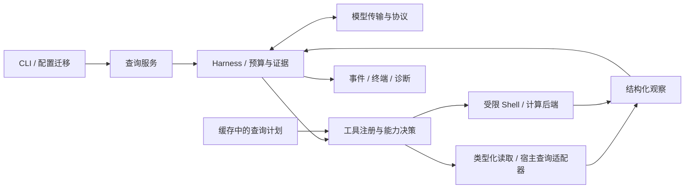

# get v4 开发计划：让查询顺畅完成

日期：2026-09-21。源码基线：`2e403a7ab09ff2e3bed52fd0c0b8385bae8667d7`（v3.2.0）。本次已执行 `git fetch --prune origin` 和 `git pull --ff-only origin main`，本地 `main` 与远端一致。

**用户已确定产品范围：仍然只做查询，但大幅减少误拦截。** v4 的目标是让用户自然地问系统、代码、文件和运行状态，get 能完成必要的读取、计算和解释。普通查询应直接执行；内部临时计算不等于修改用户系统。

本文是当前 v4 的开发计划；实现与验证进度见 [开发记录](DEVELOPMENT-v4.0.0.md)，不能将计划门槛视为已经通过。[旧 v4 目标](V4-DEVELOPMENT-GOAL.md)保留为历史诊断；其“永远禁止未知程序、脚本和命令替换”的实现约束不再直接沿用。读取优先、避免修改宿主状态的产品边界继续保留。

## 1. 本次问题与既有测绘的关系

依据仓库中的 [v3 代码审查](CODE_REVIEW-v3.md)、[v3 开发情况](V3-DEVELOPMENT-STATUS.md)、[v3.2 开发记录](DEVELOPMENT-v3.2.0.md)、[持久化说明](STATE_PERSISTENCE.md)、[v3.2 验证记录](VALIDATION-v3.2.0.md)，并逐项对照当前源码。历史报告中的通过记录只说明当时的覆盖范围，不作为 v4 的验证结果。

本次用户在 fish 中执行 `get "系统的信息情况"`，大部分系统查询成功，但下面这一整条调用被拒绝，模型随后换成 `printenv` 才取得环境信息：

```fish
echo $USER; echo $XDG_CURRENT_DESKTOP; echo $XDG_SESSION_TYPE; echo $SHELL
```

[command_policy.nim](src/command_policy.nim) 的 `implSafeVariableLength` 只接受四个具名变量 `HOME/USER/LOGNAME/PWD`，另接受 `$?`。遇到 `XDG_CURRENT_DESKTOP` 即进入“不允许 Shell 展开”的拒绝路径。`printenv NAME` 却可以查询其他环境名称，因此这是语法入口不一致导致的误拦截。即便给这几个变量加白名单，下一个正常环境名仍会遇到同类问题。

这次会话最终取得了答案，不能记作“查询完全失败”；它暴露的是额外模型往返、工具预算浪费，以及把普通查询称为 `unsafe` 的错误提示。用户反馈“几乎每次”作为优先级依据；在建立新回放集之前，不据此编造全量误拦截率。公开回归只保留命令结构和合成环境值，不复制会话中的主机标识等私人信息。

v3.2 已经做完的工作继续复用：

- POSIX 私有磁盘临时目录、Linux 沙箱中排序落盘，以及结束清理。
- AWK 内存聚合；`env`、环境名称查询、工具发现和部分串行文件读取。
- 独立最终作答轮、超额批次执行可用前缀、原生调用 ID 对应。
- 删除问句关键词驱动的“是否解释”路由、模型名称强弱判断、旧 Markdown 执行协议。
- 配置与日志跨进程锁、缓存原子替换、原生发布产物与提供商回放绑定。

## 2. 需要改变的现有架构

下表行数来自本次源码快照，表示职责集中程度，不把文件长短本身当作缺陷。

| 当前实现 | 可核对的依据 | v4 的处理 |
|---|---|---|
| 查询策略集中在 5,100 行的命令分类器 | `command_policy.nim` 同时包含跨 Shell 词法、展开限制、程序名单、各工具参数语义；未识别程序一律拒绝 | 拆开调用表示、查询能力、执行约束；已知宿主查询使用适配器，普通计算走受限计算后端 |
| 自制 Shell 子集成为通用入口 | `implParseCommand` 只保存扁平 `stages` 与若干布尔标记，不保留完整连接符、展开和重定向语义 | 简单调用优先直接传递 argv；复杂语法交给真实 Shell，在执行边界限制能力，不继续手写完整 Shell 解释器 |
| CLI 包揽业务流程 | 1,539 行 `get.nim` 内部实现审核、重复调用处理、批次授权、日志、缓存命中后的直接执行 | 建立统一查询服务；CLI 只处理参数、呈现和最终退出码 |
| 多条执行入口存在行为分叉 | 新提案先检查策略，再经 `implSafetyCheck` 重检；缓存命中另走一条审核与执行路径 | 新提案、缓存计划、修正后的提案全部走同一授权及执行入口 |
| 策略与提示词分别维护 | `harness_prompt.nim` 硬编码变量列表、命令配方、Git 绕行方案；`prompt.nim` 的二次审核把任何写入都视为不安全 | 提示词从实际可用能力生成；私有临时写入与宿主修改在所有层使用相同定义 |
| 只有 Shell 字符串一种工具载荷 | `ToolCall.command` 与 `run_readonly_shell` 贯穿协议、执行与缓存 | 增加类型化读取和进程调用，保留 Shell 作为组合查询能力 |
| 拒绝项也算已执行工具 | `harness_runtime.nim` 执行回调后直接 `metrics.toolCalls += selectedCalls.len` | 分别记录提案、实际启动、拒绝、修复和复用；预算只在对应事件上扣除 |
| 单个受限观察导致全局结束 | 任一观察 `timedOut` 或 `truncated` 就令 `finishOnly = true` | 对该步骤局部恢复或跳过；只在全局预算耗尽、无进展或证据充分时收尾 |
| 输出只有前缀压缩 | 模型反馈超过 12 KiB 时截取开头；执行结果混合 stdout/stderr | 分开错误与数据，返回分页/截断位置、数量及观察引用，允许定向补读 |
| 重复判断只比较命令文本 | `get.nim` 按同一字符串跳过后续调用，没有采样目的与时效字段 | 静态读取可复用；实时指标允许有界复采，明确时间和来源 |
| 类型化事件没有接到 CLI | `runHarness` 已有事件，实际调用传入 `eventSink: nil`，过程输出散在 CLI | 用同一事件流驱动终端状态、诊断和回放统计 |
| 配置及行为声明分散 | 3 轮默认值在配置和 Harness 中各有一份，选项还分布在帮助、安装器和文档 | 收拢选项默认值与校验；旧名称只在配置边界迁移 |

TLS、HTTP 连接复用、代理、文件锁、原子持久化、Markdown 呈现和发布装配保留。已在 v3.2 删除的旧协议、模型分级和关键词路由不再列为待删除工作。`instance`、旧配置字段等兼容逻辑集中到迁移层，避免在运行主路径长期分叉。

## 3. 查询边界与默认体验

“只查询”定义为不改变用户文件、配置、服务、进程或远端业务状态。允许 get 自身按配置保存日志/缓存，也允许查询子进程在本次运行的私有临时区写排序中间文件、脚本和计算结果；这些写入不能逃逸到用户目录，运行结束应清理。

| 用户实际需要 | v4 默认行为 |
|---|---|
| 系统信息、桌面环境、Shell、主机名 | 正常读取；普通环境名称不设四项白名单；环境未设置是数据缺失，不是危险操作 |
| 文件定位、带空格/中文路径、代码片段、跨目录搜索 | 类型化路径和读取范围；支持分页、总数及忽略规则；用户明确要求时可以读取被忽略目录 |
| 管道、变量、统计、排序、去重 | 按实际参数用途与执行能力判断；不因出现 `$`、括号或不熟悉的程序名就标记危险 |
| `git status`、普通 diff、项目语言组成 | 提供正常查询入口；内部处理只读选项、辅助程序和工作树过滤器，不让模型背诵绕行配方 |
| AWK/Python 等短脚本进行数据处理 | 在具备能力隔离的计算后端中执行，允许私有临时文件；不靠搜索脚本中的危险词来证明只读 |
| 日志、服务、容器、硬件和网络状态 | 走有明确参数契约的宿主查询能力；工具缺失或权限不足只影响相关部分 |
| 删除文件、安装软件、改配置、重启服务、发送信号或远端修改 | 超出产品范围，说明原因并停止该步骤；不引入“确认后执行修改”流程 |

普通查询不新增逐条确认。保留用户已经主动开启的 `manual-confirm`、`double-check` 和自定义限制；二次模型审核属于可选辅助，不能作为未知程序无约束运行的批准器。是否存在敏感数据，与命令是否修改状态是不同问题；默认环境上下文只带必要的非敏感字段，环境转储中的凭据值在送入模型与日志前应掩码，不能把密钥保护伪装成环境名白名单。

v4.0 不增加通用写入模式、`unsafe` 开关或一组用户必须学会调参才能正常查询的权限档位。升级后默认采用新查询策略，同时保留用户明确设置的更严限制。

## 4. 目标结构与执行路径



建议模块边界如下；先按职责迁移现有代码，不先造插件框架或做全量重写。

| 边界 | 职责和初始落点 |
|---|---|
| `query_service` | 装配查询上下文、模型、工具、缓存；接管 `get.nim` 的主业务流程 |
| `tool_registry` / `tool_types` | 统一工具 schema、参数类型、平台要求、结果契约；schema 和提示能力列表同源 |
| `query_policy` | 返回允许、可修复、不支持、超出查询范围等决策，并指定后端及约束 |
| `query_adapters` | 环境、文件、Git、宿主诊断的参数归一化与结果语义；先落地高频场景 |
| `process_runner` / `sandbox_backend` | 从 `exec.nim` 提取进程、捕获、取消、临时区及平台能力探测 |
| `observations` | stdout/stderr、执行状态、采样时间、分页引用、截断原因和证据压缩 |
| `harness_runtime` | 保留单一状态机；调度、恢复、最终回答，不直接操作终端或退出进程 |

首批工具为 `read_environment`、`read_file`、`search_files`、`run_process`、`run_shell`。名称与 schema 在 P1 固化；不为每个系统命令单独创建模型工具。

- `read_environment` 返回具名环境值及缺失状态，附宿主信息来源；区分用户交互 Shell、get 实际执行 Shell，避免把两者混为一谈。
- 文件工具接受路径、行范围/搜索条件和输出界限；提供稳定观察引用，不把大文件一次塞进上下文。
- `run_process` 接收 executable、argv、cwd 及受控 env，直接启动进程。模型给出的 purpose、`read_only` 等说明不构成权限证明；argv 仍要防工具参数注入及可执行配置。
- `run_shell` 接收明确 Shell 方言与命令。当前用户的 fish 配置继续有效；模型看见实际方言，禁止依靠文件名包含某个单词推测 Shell。复杂组合交给受限后端执行，不跨 Shell 用字符串替换“修复”。

授权后的执行计划必须携带原始提案、实际 argv/命令、cwd、后端及约束；执行器只接受这种类型。自动归一化只能做经测试保持查询含义的改变；无法证明等价时，向模型返回有类型的修正信息。缓存和审核改写后的计划同样重新判定。

### 两类执行环境

**宿主查询。** 环境和文件等可直接通过类型化接口读取；系统命令通过已知查询适配器执行，保留对变更子命令、辅助程序和控制接口的检查。适配器是减少模型语法负担的地方。服务、GPU、网络与桌面查询可能需要看到真实宿主状态，不能一概放进隔离后的空进程/设备视图再声称是宿主数据。

**受限计算。** 一般脚本、组合查询与未登记的数据处理工具，在验证过的后端里读取所需输入、做计算、输出结果。该后端必须同时限制用户文件写入、宿主进程控制、设备控制、会话/服务套接字和直接网络访问，并限制时间、进程数、内存、临时磁盘与输出。网络读取通过独立、有界的查询适配路径提供；不能让通用脚本继承 Docker socket、D-Bus、SSH agent 等宿主控制通道。

当前 Linux `bwrap --ro-bind / /` 与 macOS 文件写拒绝层只覆盖部分能力，**现有沙箱不能直接拿来放开任意脚本**。P3 必须先验证隔离后端，并测试符号链接、辅助进程、套接字和子进程逃逸边界，再启用相应能力。对 Python 启动钩子、Git filter、AWK 外部程序等旧问题，沿用已证实的回归，或证明其副作用已被新后端阻断。

没有足够隔离能力的平台仍直接提供类型化读取和已知宿主查询。计算步骤优先降为内置聚合/文件工具；确实做不到时返回 `unsupported_capability`，继续完成其余查询，不要求用户逐条确认，也不静默用无约束 Shell 执行。Windows/macOS 的能力表依据原生验证填写，不能把 Linux 的结果当作跨平台承诺。

## 5. 运行时、预算和观察

保留 v3.2 独立作答轮，改变“局部出问题就全局收尾”的逻辑。每个步骤都有 `planned/running/completed/no_match/denied/unsupported/timed_out/truncated/reused` 等明确结果，`exitCode` 仅记录进程事实。`grep` 无匹配、部分环境名不存在、工具缺失、策略拒绝和真正执行错误不再混在一个 `126` 或 `unsafe` 文案里。

预算建议初值：6 轮取证、16 次实际工具启动、最多 4 路并行、单命令 30 秒、单命令最多捕获 1 MiB，新增整次查询 120 秒总期限并预留最多 20 秒收尾。它们是 P0/P4 回放需要校准的候选默认值，不是本轮测得的最优值；简单问题拿到证据即可回答，无需耗尽额度。

- 预算包括独立的提案上限和恢复上限：初值每轮最多接收 16 个提案、每次查询最多 2 次失败后的模型修正；拒绝不算启动，但仍消耗提案、修正和时间预算。
- 本地等价归一化不消耗额外模型轮；无法等价修复时才请求模型。最终作答不与取证争用最后一个名额。
- 总期限覆盖模型请求、重试、排队和工具执行；传输超时使用剩余时间，不能让现有 300 秒请求超时突破整次查询预算。启动工具时要留出收尾时间，用户 Ctrl-C 可取消全部相关进程。
- 失败恢复只影响对应步骤：缩小搜索范围、读下一页、换已有工具或略过该项。重复超时且没有新信息时不继续重试。
- 将进程输出截断、模型反馈压缩、分页未读完分别表示。输出上限保护资源，不自动等价为“整次任务失败”。
- 动态观察带采样时间；模型明确要求第二次采样时允许有界重读，不以命令文本相同为由永久复用。
- `direct` 保留原始输出和进程退出语义；普通回答模式有完成/部分完成状态，不能仅因模型返回了文字就默认成功。全部关键取证失败时为非零，已回答问题且只是可选项缺失时可以为零，并说明缺失；关键项由查询计划列出，不靠中英文关键词路由判断。

终端默认呈现当前步骤和答案。成功恢复的内部修正不刷醒目的危险警告；有实际影响的缺失要在答案里说明。诊断模式保留提案、归一化、策略原因、执行与恢复事件，能查清发生了什么。扩展现有事件结构并接入 CLI，不新增另一套独立日志流程。

答案应区分观察事实、推断和未采集项。系统概况不因一次 CPU 快照推断长期健康，也不仅凭固件日期断言“偏旧”；只有用户的问题需要时再扩大查询范围。工具输出视为数据，不允许其中的文字扩大查询权限。

## 6. 缓存、配置与兼容迁移

缓存中保存的命令计划经过统一执行入口重新验证；v4 缓存身份包含策略版本、工具 schema、Shell 方言、后端能力及影响执行的配置。动态指标缓存的是可复用查询计划，不默默复用旧观察；用户显式要求缓存结果时保留功能，并展示采集时间。

v3 配置原样读取后在内存中迁移，保留服务地址、模型、密钥、代理、Shell 和用户设置。默认值集中维护；`manual-confirm` 等明确设置保持有效。旧协议只在解码边界兼容，不让旧 `run_readonly_shell` 绕过新策略。策略改变后旧命令/结果缓存失效重建，不删除用户配置或日志。

不修改历史发布报告的结论。新架构、默认行为、平台能力差异同时更新中英文 README、man、安装器和版本回放脚本；发布时才更新版本号及新验证记录。本次规划不改变已安装程序或运行配置。

## 7. 分阶段交付

| 阶段 | 交付物 | 完成条件与依赖 |
|---|---|---|
| P0：建立可用性基线 | 脱敏回放夹具、失败分类、当前版本基线报告 | 固化本次系统查询、环境展开、Git、真实多语言树等场景；区分误拦截、缺失、预算和模型错误，不用主观抱怨代替分母 |
| P1：统一执行入口 | 查询服务、工具类型、结构化策略结果、事件接线、缓存统一入口 | 新命令、缓存、审核改写都经过同一路径；主流程不在中间调用 `quit`；旧查询行为有确定性回归 |
| P2：高频查询可用 | 类型化环境/文件工具、argv 执行、首批宿主适配器、普通环境变量和路径处理 | 本次命令及常见中英文变体不再误拦截；普通系统与代码查询无需模型猜内部限制；Git 正常入口有真实执行验证 |
| P3：通用数据处理 | 平台能力探测、受限计算后端、复杂 Shell/短脚本执行、缺失能力降级 | 先通过隔离验收再开放；查询允许私有临时写，宿主与远端变更仍不可达。Linux 先验证，其他平台分别记录支持范围 |
| P4：恢复与证据 | 分账预算、局部修复/分页、重复采样、stdout/stderr 分离、最终状态 | 单条失败不拖死整个查询；无工具循环；有证据能作答、证据不足不伪报完成；测出并校准默认预算 |
| P5：清理与发布 | 删除被替代的策略分支和双路径、配置兼容、三平台 CI、真实模型回放、文档与发布材料 | 达到下节门槛，发布材料绑定最终二进制；不以行数减少或旧测试总数作为发布完成证明 |

按 P0 → P1 → P2 建立可用链路；P3 和 P4 在该链路上分别落地，P5 汇总。首个可体验构建在 P2 结束时提供 `.ci/` 内的独立二进制。P2 只能称阶段预览，不能宣称通用脚本或整个 v4 已完成。若 P3 证明某平台不可行，必须写明能力缩减并重新评估发布范围，不能静默把“未知即拒绝”搬回默认主路径。

v4.0 不以插件系统、多代理、后台守护进程、交互式 TUI、自动修改项目或全量重写网络/存储模块为前置条件。工作量集中在查询执行和结果质量。

## 8. 验收与衡量方法

### 必须成功的回归

| 场景 | 验收内容 |
|---|---|
| 本次系统信息会话 | fish 下原始查询与命令序列取得可核对的系统、内存、磁盘和桌面会话信息；已存在字段零误拦截、零确认；缺失 HOSTNAME 不导致整次失败 |
| 环境和展开 | XDG、SHELL、自定义合成环境名；引号、空值、空格、元字符、参数注入、普通数据与命令位置区分；fish/bash 分别运行 |
| 文件与代码 | 中文/空格/前导短横路径、分页、无匹配、权限不足；按行读取和准确搜索，无需全文件回灌 |
| 多语言项目 | 嵌套 build/target/.venv/node_modules/_deps；文件数与代码行数各有独立真值；可显式纳入忽略目录 |
| Git 常规问题 | 分支、暂存/未暂存/未跟踪、普通 diff；带可执行 filter/hook/config 的夹具中确认无宿主副作用 |
| 聚合与脚本 | AWK 统计、私有临时排序、受限 Python 解析；后端不支持时内置计算能覆盖核心任务，数据正确 |
| 部分失败 | 同批一个工具缺失/拒绝/超时，其他观察保留；仅恢复相关步骤，模型最终明确说明缺口 |
| 输出与预算 | 超大输出、末尾有关键数据、分页续读、提案超额、重复失败、收尾模型失败；全部保持有界且状态诚实 |
| 宿主诊断 | 真实服务/进程/设备观察与隔离计算视图区分；不把隔离后的空列表当成宿主无进程/无服务 |
| 修改边界 | 宿主文件、配置、服务、进程信号、控制套接字、远端修改与辅助程序；不因新语法能力失去原有边界 |
| 兼容 | native/JSON 协议、缓存命中、无工具请求、direct、v3 配置迁移；用户配置、密钥和安装程序保持不变 |

旧策略测试分成两类：真实副作用/解析绕过回归继续保留；仅因旧能力不足而拒绝的正常查询改成允许并验证实际结果。不能通过整批删除拒绝测试或只验证返回值 `allowed=true` 来通过验收。

### 发布门槛

1. 建立至少 40 个常用自然语言查询场景，覆盖系统、环境、文件代码、Git、运行诊断，每类至少 8 个；核心夹具提供独立事实答案。同一平台下，对 v3.2 和候选版本用同一场景、配置和测量方法对比。
2. 上表固定必过场景在适用平台上全部通过；普通查询的确定性测试零误拒绝。本次原始会话是必过项，不能被总体平均数掩盖。
3. 真实模型回放每个场景至少运行 3 次，至少一种实际使用的服务。每个发布必测提供商/平台组合分别要求端到端任务完成率 ≥95%、误拦截任务占比 ≤2%；不合并多个组合来隐藏失败。模型结果要基于独立真值，不只检查回答含某个词。
4. 完成率分母是该组合全部必测运行次数；误拦截任务占比是至少一次正常查询被拒绝的任务次数除以全部运行次数，另报被误拒绝提案数/正常提案数。缺工具、网络错误、预算不足和模型出错单独列出，不能从完成率分母中随意排除。可选平台能力的跳过项另列，不计为通过。
5. 同时报告每任务模型请求数、修正数、实际工具启动数、token、首个观察耗时、总耗时 p50/p95 和峰值内存。简单查询的模型往返数不得因新架构增加；系统会话的环境读取不应再多花一次纠错往返。
6. 修改边界、超时取消、进程回收、临时区清理、配置迁移和缓存重验证均须通过；完整 Linux/Windows/macOS 原生套件在 CI 执行。沙箱可用和不可用两条路径都要覆盖。

实时内存和负载不写死成用户截图中的数字；使用同时间窗口的宿主基准或合成夹具检查。原始记录应保留失败，不能多次重跑后只公布一次成功。

### 开发环境约束

严格按 [AGENTS.md](AGENTS.md) 执行：编译前检查 `MemAvailable` 和 `/proc/pressure/memory`；不足 6 GiB 或 `full avg10 >= 2` 时交给 CI。一次只编译一个目标，Linux 使用 `nice -n 10` 与 Nim `--parallelBuild:1`；本地测试聚焦，持久化测试最多四个小进程。开发二进制放 `.ci/` 并显式选择，配置与密钥测试使用临时根；不更换用户安装程序，不操作桌面扩展、GNOME Shell 或用户终端窗口。有其他会话修改同一 checkout 时使用独立 worktree。

## 9. 规划阶段交付状态

以下为规划落盘时的记录；后续实现进度见 [v4 开发记录](DEVELOPMENT-v4.0.0.md)。

- 已同步并确认源码基线，阅读仓库内相关测绘与历史开发记录。
- 已按当前源码定位本次误拦截及运行时、执行入口、观察和配置中的遗留问题。
- 已确认“只做查询、大幅减少误拦截”的方向，形成以上实施顺序与验收标准。
- 本轮仅编写计划和历史文档导航；未修改产品代码、运行配置或安装副本，未编译、调用真实模型或执行上述新验收。
